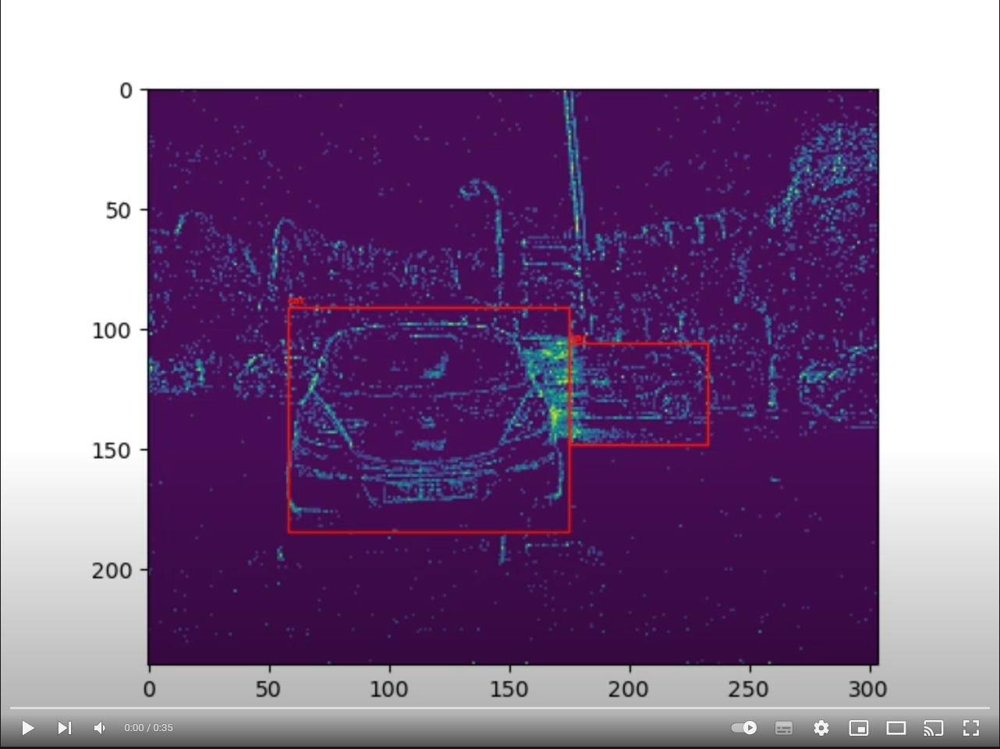

# Object Detection with Spiking Neural Networks on Automotive Event Data
The dataset used is the Prophesee GEN1 dataset, which is an event-based dataset capturing automotive scenes. Data is event-driven and represents pixel changes over time, including timestamps, x/y coordinates, and polarity changes.
Format: Events are represented as sparse changes in pixel intensity, recorded asynchronously when a change occurs rather than at regular intervals.

Our main contributions are:
1. We present a novel approach to encode event data called *voxel cube* that preserves their binarity and temporal information while keeping a low number of timesteps. (see the `datasets` module)
2. We propose a new challenging dataset for classification on automotive event data: GEN1 Automotive Classification, generated using the Prophesee object detection dataset of the same name. (see `datasets/classification_datasets.py`)
3. We train four different spiking neural networks for classification tasks based on popular neural network architectures (VGG, MobileNet, DenseNet) and evaluate them on  automotive event datasets, setting new state-of-the-art results for spiking neural networks. (see the `models` module)
4. We present spiking neural networks for object detection composed of a spiking backbone and SSD bounding box regression heads that achieve qualitative results on the real-world GEN1 Automotive Detection event dataset. (see `object_detection_module.py`)
 
Our codes require [SpikingJelly 0.0.0.0.4](https://github.com/fangwei123456/spikingjelly/tree/0.0.0.0.4), PyTorch 1.11.0, Torchvision 0.11.1, PyTorch Lightning 1.4.4 and Torchmetrics 0.5.0.

# Results
results have been improved by correcting errors in the dataset generation and using more epochs for classification tasks (30 epochs instead of 10).

## Object Detection on Prophesee GEN1

| **Models** | **#Params** | **ACCs/ts** | **COCO mAP &#8593;** | **Sparsity &#8595;** |
|---|:---:|:---:|:---:|:---:|
| VGG-11 + SSD | 12.64M | 11.07G | 0.174 | 22.22% |
| MobileNet-64 + SSD | 24.26M | 4.34G | 0.147 | 29.44% |
| DenseNet121-24 + SSD | 8.2M | 2.33G | 0.189 | 37.20% |

Train a VGG-11 + SSD model on Prophesee GEN1 with 5 timesteps and 2 tbins:

    python object_detection.py -path path/to/GEN1_dataset -backbone vgg-11 -T 5 -tbin 2 -save_ckpt

To measure test mAP and sparsity on a pretrained model:

    python object_detection.py -path path/to/GEN1_dataset -backbone vgg-11 -T 5 -tbin 2 -pretrained path/to/pretrained_model -no_train -test

Other parameters are available in `object_detection.py`.
